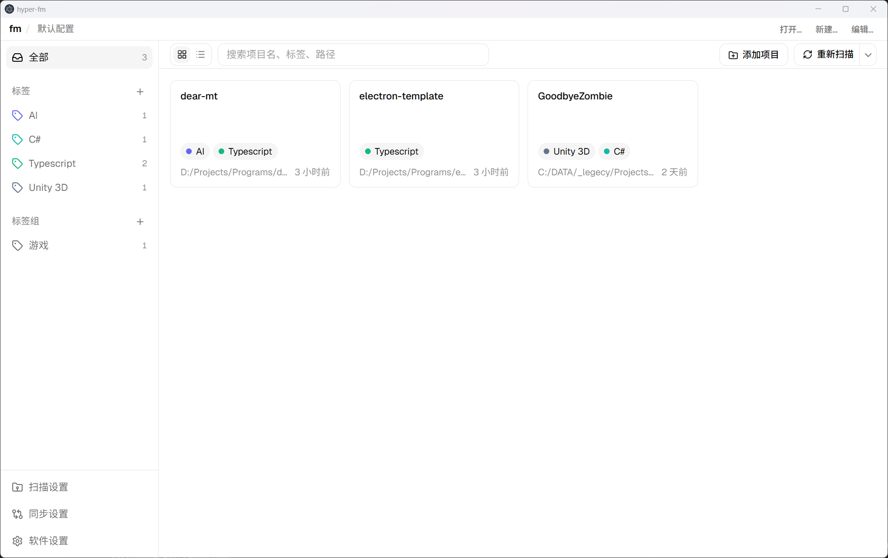

# hyper-fm

`hyper-fm` 是用于管理和同步文件夹的桌面应用，主要功能：

- **集中查看项目**：集中展示散落在不同目录的项目，按标签、动态标签和标签组筛选查看。
- **维护项目信息**：存储项目名称、描述、标签等信息。
- **多设备共享**：通过共享目录、P2P等同步机制实现跨设备管理。

## 使用说明

### 界面导览

- **侧边栏**：根据标签、动态标签和标签组筛选项目。
- **主区域**：浏览项目卡片、搜索项目。
- **项目详情**：点击项目卡片查看详细信息，编辑名称、描述、标签和元数据。
- **设置面板**：管理配置文件、扫描根、忽略规则和同步设置。

### 基本使用

#### 管理项目
1. 启动应用，如果还没有配置，选一个目录创建新的配置文件。
2. 点击【添加项目】添加需要管理的项目；也可以在按钮菜单中使用【批量添加项目】一次选择多个目录。
3. 在主界面搜索、筛选和浏览项目。
4. 点击项目进入详情页，编辑项目信息和标签。

#### 同步项目
1. 配置同步：在同步设置面板添加同步方式，例如共享目录、P2P。
2. 向外同步：将项目文件导出到文件夹或同步到云端。
3. 切换设备：将 `共享配置文件` 复制到其他设备，启动软件导入配置文件，（可选）添加 `扫描根目录` 识别项目。
4. 执行同步：根据配置的同步方式进行同步，例如从共享目录同步、使用 P2P 同步。

### 核心概念

- **项目**：一个文件夹，根据 `文件夹名称`/`元数据文件`/`文件指纹` 唯一识别。
- **共享配置文件**：包含项目元数据的 JSON 文件，用于在设备间同步项目信息。
- **推荐本地配置目录**：工作目录下的 `.local/`，适合存放你自己的 `fm.shared.json` 与 `fm.local.json`，不会提交到 Git。
- **扫描根目录**：用于在本机查找共享配置文件中已添加的项目。

## 下载与安装

请前往 [Releases](../../releases) 页面下载程序，点击`.exe`文件运行。

> 当前仅有 Windows 版本。
## 开发与贡献

如果你想参与开发，请阅读：

- [AGENTS.md](AGENTS.md)
- [开发文档](docs/development.md)
